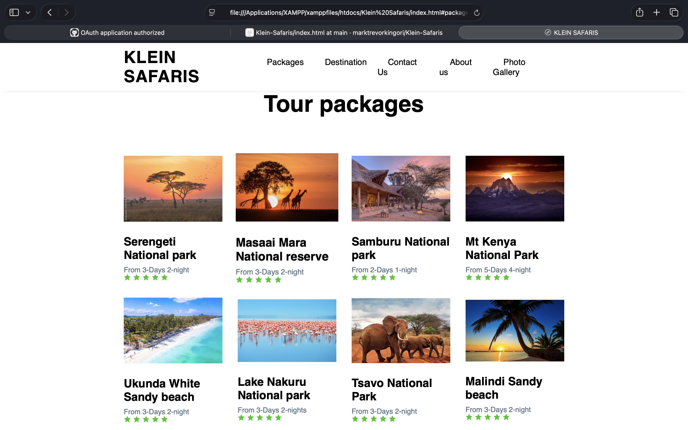

# 🌍 Klein Safaris Website

A responsive travel and tourism website developed for **Klein Safaris** using **HTML5, CSS3, and JavaScript**.

## 📖 Overview

Klein Safaris is a modern tourism website designed to showcase local and international travel packages. The website features an intuitive layout, destination galleries, travel information, and responsive design for an excellent user experience across desktop and mobile devices.

## ✨ Features

- Responsive design
- Safari package listings
- International destination showcase
- Interactive image gallery
- Contact page
- Modern user interface

## 🛠️ Technologies Used

- HTML5
- CSS3
- JavaScript

---

# 📸 Project Screenshots

## 🏠 Home Page


---

## 👥 About Us


---

## 🦁 Safari Packages



---

## 🌍 International Destination


---

## ✈️ More International Destinations


---

## 🖼️ Gallery


---

## 📞 Contact Us


---

# 🚀 Getting Started

Clone the repository:

```bash
git clone https://github.com/marktrevorkingori/Klein-Safaris.git
```

Open the project folder and launch:

```
index.html
```

in your preferred web browser.

---

# 👨‍💻 Author

**Marktrevor Nderitu Kingori**

- GitHub: https://github.com/marktrevorkingori
- LinkedIn: https://www.linkedin.com/in/marktrevorkingori

---

## 📄 License

This project is intended for educational and portfolio purposes.
